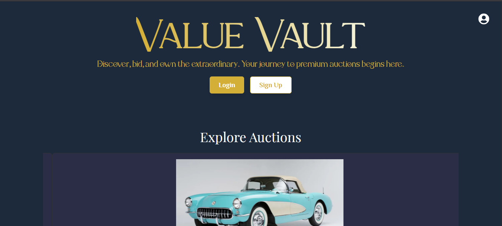
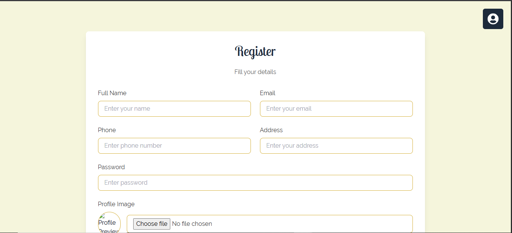
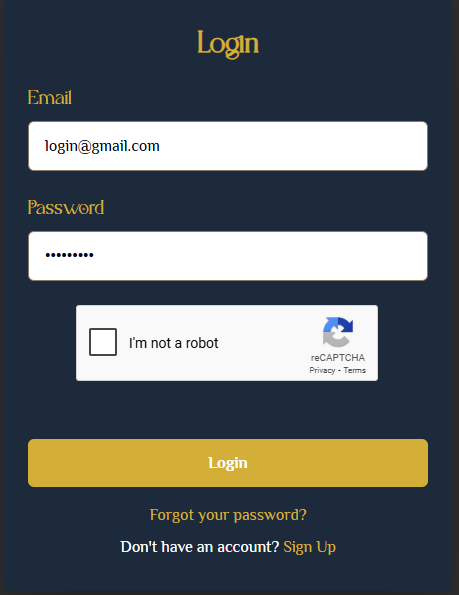

# Value Vault

Value Vault is an **online auction system** designed to provide a secure, real-time platform for buying and selling items. It features a user-friendly interface, dynamic bidding, and robust backend handling.

---

## Features

- User authentication and profile management
- Real-time bidding system
- Multiple auction categories
- Item search and filtering
- Bid history tracking
- Notifications for winning bids
- Responsive design for desktop and mobile

---

## Screenshots

### Home Page

### Auction Page

### Auction Page 2

### Regsiter Page

### Login Page

---
